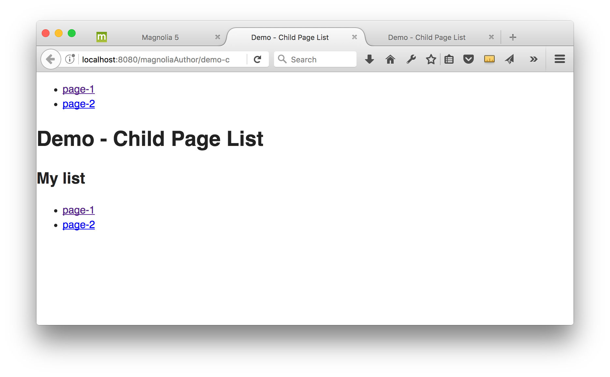
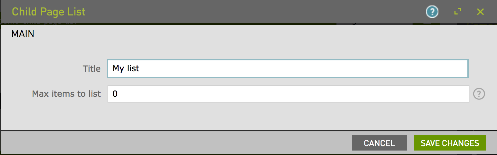

# Child Page List - Component template for Magnolia CMS

List of child pages.

## Features
> [Provide a list of the key features this component provides for content authors. Include screenshots of the rendered component and the dialog.]

## Usage
> [Provide details of how a developer can make the component template available to content authors. This can include any special instructions about webresources or availability. This could include instructions on 3rd party dependencies such as jquery.
Describe how a template can be configured with parameters if applicable.]

Make the component available to authors, and include the files in `webresources` on your pages using standard magnolia techniques.

(To make this component available on the mtk basic page, you could use the decoration included in `_dev/decorations`.)

## Demo
> [Provide how to view any included demonstration pages.]

To see a page demonstrating this component, open the Pages app in Magnolia AdminCentral and import the files in `_dev/demos`. (Import it directly at the root of the tree to see an example of the included css styling.)

## Information on Magnolia CMS
This directory is a Magnolia 'light module'.

https://docs.magnolia-cms.com

Search the docs for `sharing light modules` for details on how to share and use light modules on npm and github.

## Contribute to the Magnolia component ecosystem
It's easy to create components for Magnolia and share them on github and npm. I invite you to do so and join the community. Let's stop wasting time by developing the same thing again and again, rather let's help each other out by sharing our work and create a rich library of components.

Just add `magnolia-light-module` as a keyword to npm's package.json to make them easy to find and use on npm.

## License

MIT

## Contributors

Magnolia, https://magnolia-cms.com

Christopher Zimmermann, @topherzee
